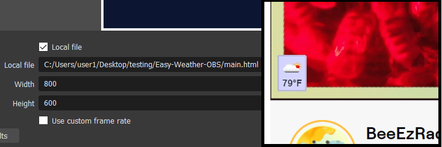

# Easy-Weather-OBS
An HTML Overlay, that displays the Current Temperature and Conditions for a City of your choice; and will automatically refresh, as often as you'd like. 

*minimal assemebly required; you will need a "coding text editor" - Visual Studio Code, Brackets, etc.

*Disclaimer, I'm not responsible if you get charged by "Open Weather" for using their API - they could change price plan, or you editted code incorrectly, etc. user descretion adivsed*

Navigate to OpenWeather, and generate an API key, it will take a few hours to activate within Open Weather's system.. fyi

Go here: https://home.openweathermap.org/api_keys
Create and account, etc; with the free version, you get 1000 calls per day. I personally have mine set to 3 minutes, so its only 480 calls per day

!-NEVER SHARE YOUR API KEY-! - its a super secret!
 
Before you download; lets first get a City's current conditions,

=== Testing your API key ===

I couldnt get some cities to work, so I added a seperate Zipcode URL to use if this happens for you.

To test for City:
Replace "rome,ny,us" with your City, State, and Country 
*note the commas between each variable

If youre not somthing easy like us, or uk... go here- 
and find your country's "Alpha-2 Code" : https://en.wikipedia.org/wiki/List_of_ISO_3166_country_codes

Then replace the "fake" API key, with the one that you personally generated on Open Weather.
If it doesnt work; remember you will probaly have to wait a few hours until it activates...the "fake" API keys below are "2g7d5k7dk5g72k52lfjglj123" & "k54glh7f34fjl15h3j3hf5f13hl7" respectively 

https://api.openweathermap.org/data/2.5/weather?q=rome,ny,us&appid=2g7d5k7dk5g72k52lfjglj123&units=imperial

If the City way doesnt work, Try the Zipcode URL instead,

https://api.openweathermap.org/data/2.5/weather?zip=13316,us&appid=k54glh7f34fjl15h3j3hf5f13hl7&units=metric

To Change between F, C - Replace the last word with either:

"imperial" = F, or
  "metric" = C

If youre able to getting everything working thus far, you are now ready to finally download "Easy-Weather-OBS"

=== Test Weather App ===

To Download the ZIP for this app; click the Green button "<>Code" -> "Download Zip" -> unzip/extract the App.

After you have your URL working; open "weather.js" in your code editor- then add your working weather URL to the code, pictured below - then Save  

if you want to LENGTHEN the timer; you can do so, but do not go LESS THAN "3*60000"! - then Save  

*Edit "styles.css" until it looks good to you. - then "Save All" 
*Edit "styles.css" until it looks good to you. - then "Save All"

Now, in the the folder, "Easy-Weather-OBS" double click the "main.html" file - it should open your browers, displaying the picture below.  

Wait 3 minutes, and the App should begin working...if you open your browser's Dev Tools, view the Console; and you should see these calls coming in every 3 minutes.

=== Add to OBS ===

Open OBS, add a source, click "Browser" - name it whatever you'd like, next
Click that its a "local File" and browse to your new app, and click on the "main.html"
Place whereever you'd like.

-Poggers in the chat. 

